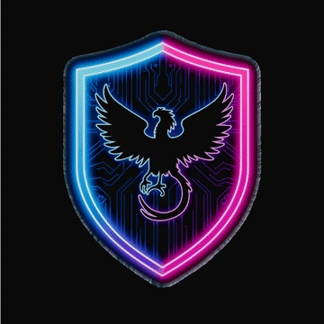
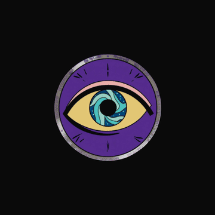
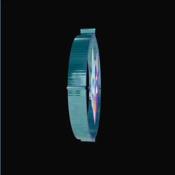

<div align="center">

# `>_ 3d-logo`

**Turn any flat logo into a premium 3D spinning coin.**\
Chrome edges &bull; Environment reflections &bull; Zero 3D modeling.

[](https://github.com/hasuwini77/3d-logo-skill)
[](LICENSE)
[](https://github.com/pmndrs/react-three-fiber)

</div>

---

<div align="center">
<table>
<tr>
<td align="center"><br/><sub><b>Phoenix Shield</b></sub></td>
<td align="center"><br/><sub><b>Cosmic Eye</b></sub></td>
<td align="center"><br/><sub><b>Wolf Compass</b></sub></td>
</tr>
</table>
</div>

> The rim isn't a generic circle — it traces your logo's actual outline pixel by pixel.

## Install

```bash
claude install github:hasuwini77/3d-logo-skill
```

## Usage

```
Make my logo at public/logo.png into a 3D spinning coin
```
```
Use /3d-logo on src/assets/brand-logo.png with night reflections
```

Drop the generated component anywhere in your React app:

```tsx
import { SpinningLogo3D } from './SpinningLogo3D'

<SpinningLogo3D size={540} />
```

## Environment Presets

| Preset | Best for | Feeling |
|--------|----------|---------|
| **studio** | Corporate, SaaS | Clean, professional |
| **warehouse** | Gaming, industrial | Gritty, textured |
| **city** | Tech, startups | Urban, dynamic |
| **night** | Dark themes, premium | Moody, elegant |
| **dawn** | Health, wellness | Soft, warm |
| **sunset** | Creative, entertainment | Rich amber |

## How It Works

1. **Background removal** — dark pixels converted to transparent via offscreen canvas
2. **Perimeter extraction** — alpha channel scanned row-by-row to trace the logo outline (~800 vertices)
3. **Face rendering** — two `PlaneGeometry` faces with correct UVs (readable on both sides)
4. **Rounded chrome rim** — semicircular cross-section `BufferGeometry` (8 segments) with normals that sweep from front-facing to outward to back-facing, producing a smooth highlight gradient like a real coin edge
5. **Reflections** — `MeshPhysicalMaterial` with `metalness: 1.0, roughness: 0.12, clearcoat: 1.0` for polished chrome with a wet lacquer finish

## Customization

| Constant | Default | Controls |
|----------|---------|----------|
| `PLANE_SIZE` | 4.8 | Logo face size (3D units) |
| `THICKNESS` | 0.45 | Coin edge thickness |
| `SPIN_SPEED` | 0.35 | Rotation speed (rad/s) |
| `BG_THRESHOLD` | 18 | Background removal sensitivity (0–255) |

## Requirements

```bash
npm install three @react-three/fiber @react-three/drei
npm install -D @types/three
```

## Contributing

1. Fork &rarr; feature branch &rarr; edit `.claude/skills/3d-logo/SKILL.md`
2. Test locally with `claude install .`
3. Open a PR with before/after examples

Ideas: more presets, hover interactions, glow effects, shape detection improvements.

## License

MIT &mdash; do whatever you want with it.

---

<div align="center">
<sub>Built with <a href="https://github.com/pmndrs/react-three-fiber">React Three Fiber</a> + <a href="https://github.com/pmndrs/drei">drei</a> + <a href="https://threejs.org">Three.js</a></sub>
<br/><br/>
<b>If this skill saved you time, drop a ⭐</b>
</div>
